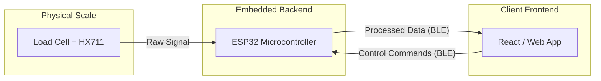

# Log 01: Preliminary Setup
**Date:** 14 February 2026

## Vision
**Bloom** is a smart coffee brewing journal designed to bridge the gap between physical brewing metrics and digital data visualization. 

Mainly born out of my desire to save >200 dollars on "smart scales" on the market. I figured it would be a good way to cap off my college by applying my computing knowledge to a practical project that I use.

##  High-Level Architecture (L0)

I'll put off creating a dedicated server/backend to handle data for now - will come back to this once I have a working prototype.

## Tech Stack 
- **Microcontroller**: DOIT ESP32 DevKit V1
- **Sensors**: Digital Load Cell Weight Sensor Module
- **Client app**: React